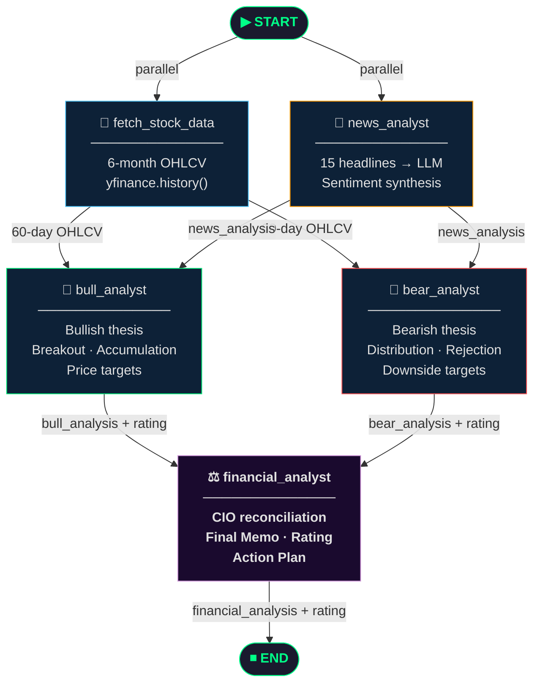

<div align="center">

# 🐂 BULLBEAR — Stock Analysis Terminal 🐻

**A multi-agent AI system that debates both sides of every stock — so you don't have to.**

[](https://www.python.org/)
[](https://langchain-ai.github.io/langgraph/)
[](https://fastapi.tiangolo.com/)
[](https://langchain-ai.github.io/langgraph/)
[](https://opensource.org/licenses/MIT)

> ⚠️ **Not financial advice.** This is an AI research tool for educational and informational purposes only.

</div>

---

## 📸 Screenshot

![BullBear Terminal UI]


> Dark-mode terminal interface — enter any global ticker (US, India NSE/BSE, London, Hong Kong) and get a full investment debate in under a minute.

---

## 🧠 What Is This?

**BullBear** is an agentic stock analysis terminal built on **LangGraph**. When you enter a ticker symbol, a team of four AI agents powered by your choice of LLM (Claude, GPT, Grok, or Ollama) work in parallel to:

1. **Fetch** 6 months of OHLCV price data and the latest 15 news headlines (via `yfinance`)
2. **Argue the Bull Case** — technical breakouts, institutional accumulation, catalyst alignment
3. **Argue the Bear Case** — distribution patterns, resistance failures, negative newsflow
4. **Synthesise a Final Verdict** — the CIO agent reconciles both sides into a plain-English investment memo with a 1–10 conviction rating

The result: a structured, evidence-linked investment thesis for **any publicly listed stock in the world** — delivered in ~30–45 seconds, cached for 24 hours.

---

## ✨ Features

| Feature | Details |
|---|---|
| 🌍 Global Markets | US, India (NSE/BSE), London, Hong Kong — any `yfinance`-supported ticker |
| ⚡ Parallel Agents | Data fetch and news analysis run concurrently; Bull & Bear agents run simultaneously |
| 📊 Structured Reports | Price/volume evidence, news-price confluence, targets, stop-losses, scorecard |
| 🔢 Conviction Ratings | 1–4 Bear · 5–6 Neutral · 7–10 Bull — extracted from every agent |
| 💾 24-Hour Cache | Re-runs return instantly; no wasted API calls |
| 🤖 Multi-LLM Support | **Claude** · **GPT-4** · **Grok** · **Ollama (local)** — choose your provider |
| 🌙 Dark/Light Mode | Toggle in the UI header |
| 📜 Previous Reports | History panel with one-click expand and delete |
| 🖥️ Zero-Config UI | Single HTML file served by FastAPI — no npm, no build step |

---

## 🤖 LLM Independence

**BullBear works with ANY LLM provider.** Just change your `.env` file:

```env
# 🔷 Claude (Anthropic)
MODEL_NAME=claude-opus-4-7
ANTHROPIC_API_KEY=sk-ant-...

# 🟡 GPT-4 (OpenAI)
MODEL_NAME=gpt-4
OPENAI_API_KEY=sk-...

# ⚫ Grok (xAI) — Default
MODEL_NAME=grok-3-mini
XAI_API_KEY=xai-...

# 🟣 Ollama (Local)
MODEL_NAME=llama2
# (No API key needed)
```

**No code changes needed.** The model is auto-detected from `MODEL_NAME`.

---

## 🏗️ Architecture

### LangGraph Agent Workflow



### System Architecture

```
┌─────────────────────────────────────────────────────────────────┐
│                         Browser / UI                            │
│                    bull_bear_ui.html (SPA)                       │
└──────────────────────────┬──────────────────────────────────────┘
                           │ HTTP POST /analyze
                           ▼
┌─────────────────────────────────────────────────────────────────┐
│                    FastAPI  (main.py)                           │
│   • Serves HTML        • In-memory cache (24h TTL)             │
│   • /analyze endpoint  • Error handling & retry logic           │
└──────────────────────────┬──────────────────────────────────────┘
                           │ ainvoke({"ticker": "..."})
                           ▼
┌─────────────────────────────────────────────────────────────────┐
│              LangGraph  StateGraph  (BullBearState)             │
│                                                                 │
│   ┌──────────────────┐      ┌──────────────────────┐           │
│   │ fetch_stock_data │      │    news_analyst       │           │
│   │  (yfinance OHLCV)│      │  (yfinance + LLM)    │           │
│   └────────┬─────────┘      └──────────┬────────────┘           │
│            │ (parallel fanout)         │                        │
│     ┌──────▼──────┐      ┌─────────────▼────────┐              │
│     │ bull_analyst│      │    bear_analyst       │              │
│     │   (LLM)     │      │      (LLM)            │              │
│     └──────┬──────┘      └─────────────┬─────────┘              │
│            │ (fanin)                   │                        │
│            └──────────┬────────────────┘                        │
│                       ▼                                         │
│              ┌─────────────────┐                                │
│              │financial_analyst│                                │
│              │   (LLM CIO)     │                                │
│              └────────┬────────┘                                │
└───────────────────────┼─────────────────────────────────────────┘
                        │ JSON response
                        ▼
              { bull_analysis, bear_analysis,
                financial_analysis, ratings, cached }
```

### State Object

```python
class BullBearState(TypedDict):
    ticker:                      str    # Input: e.g. "AAPL"
    time_series_data:            dict   # 6-month daily OHLCV
    news_analysis:               str    # LLM sentiment synthesis
    bull_analysis:               str    # Bullish thesis (markdown)
    bull_analysis_raiting:       str    # "X / 10"
    bear_analysis:               str    # Bearish thesis (markdown)
    bear_analysis_raiting:       str    # "X / 10"
    financial_analysis:          str    # Final formatted memo
    financial_analysis_raiting:  str    # "X / 10"
```

---

## 🛠️ Tech Stack

| Layer | Technology |
|---|---|
| **AI Orchestration** | [LangGraph](https://langchain-ai.github.io/langgraph/) 0.2+ |
| **LLM Support** | Multi-provider via `langchain.chat_models.init_chat_model()` |
| **Supported Models** | Claude (Anthropic) · GPT-4 (OpenAI) · Grok (xAI) · Ollama (local) |
| **Market Data** | [yfinance](https://github.com/ranaroussi/yfinance) (free, no rate limits) |
| **Backend** | [FastAPI](https://fastapi.tiangolo.com/) + [Uvicorn](https://www.uvicorn.org/) |
| **Frontend** | Vanilla HTML/CSS/JS (single file, zero dependencies) |
| **Async Runtime** | Python `asyncio` — all LLM calls are non-blocking |
| **Env Management** | `python-dotenv` |

---

## 🚀 Getting Started

### Prerequisites

- Python 3.11+
- An API key from at least ONE LLM provider (or Ollama installed for local use)

### Installation

```bash
# 1. Clone the repository
git clone https://github.com/YOUR_USERNAME/bullbear-terminal.git
cd bullbear-terminal

# 2. Create and activate a virtual environment
python -m venv myenv
source myenv/bin/activate        # macOS / Linux
# myenv\Scripts\activate         # Windows

# 3. Install dependencies
pip install langgraph langchain langchain-openai langchain-xai fastapi uvicorn yfinance python-dotenv

# 4. Configure environment variables
cp .env.example .env
```

### Configure Your LLM Provider

Edit `.env` and uncomment ONE provider:

#### **Option 1: Claude (Recommended for accuracy)**

```env
MODEL_NAME=claude-opus-4-7
ANTHROPIC_API_KEY=sk-ant-xxxxxxxxxxxxx
TEMPERATURE=0.2
```

Get your key: https://console.anthropic.com

#### **Option 2: GPT-4 (Most compatible)**

```env
MODEL_NAME=gpt-4
OPENAI_API_KEY=sk-xxxxxxxxxxxxx
TEMPERATURE=0.2
```

Get your key: https://platform.openai.com/api-keys

#### **Option 3: Grok (Fast & cost-effective)**

```env
MODEL_NAME=grok-3-mini
XAI_API_KEY=xai-xxxxxxxxxxxxx
TEMPERATURE=0.2
```

Get your key: https://console.x.ai

#### **Option 4: Ollama (Free, local)**

```bash
# 1. Install Ollama from https://ollama.ai
# 2. Pull a model: ollama pull llama2
# 3. Set in .env:
MODEL_NAME=llama2
# (No API key needed)
```

### Run

```bash
python main.py
```

The server starts on `http://localhost:8000` and **automatically opens your browser**.

---

## 📡 API Reference

### `POST /analyze`

Run a full multi-agent analysis on a ticker.

**Request:**
```json
{ "ticker": "AAPL" }
```

**Response:**
```json
{
  "bull_analysis":               "## Bull Case Synthesis\n...",
  "bull_analysis_raiting":       "8 / 10",
  "bear_analysis":               "## Bear Case Synthesis\n...",
  "bear_analysis_raiting":       "3 / 10",
  "financial_analysis":          "=== FINANCIAL ANALYSIS REPORT ===\n...",
  "financial_analysis_raiting":  "7 / 10",
  "cached":                      false
}
```

**Error responses:**
- `400` — Invalid ticker or data fetch error
- `429` — Rate limit exceeded (try again in a few minutes)
- `500` — Server error (check logs)

### `GET /`

Serves the BullBear UI (`bull_bear_ui.html`).

---

## 💡 Supported Ticker Formats

| Market | Example Tickers |
|---|---|
| 🇺🇸 US (NYSE / NASDAQ) | `AAPL`, `TSLA`, `NVDA` |
| 🇮🇳 India NSE | `SBIN.NS`, `TCS.NS`, `RELIANCE.NS` |
| 🇮🇳 India BSE | `SBIN.BO`, `CFEL.BO` |
| 🇬🇧 London (LSE) | `BARC.L`, `HSBA.L`, `BP.L` |
| 🇭🇰 Hong Kong (HKEX) | `0700.HK`, `0005.HK` |

> Any ticker supported by `yfinance` will work.

---

## ⚙️ Configuration

### LLM Configuration

| Provider | Key Variable | Model Name Example |
|---|---|---|
| **Anthropic Claude** | `ANTHROPIC_API_KEY` | `claude-opus-4-7` |
| **OpenAI GPT** | `OPENAI_API_KEY` | `gpt-4` |
| **xAI Grok** | `XAI_API_KEY` | `grok-3-mini` |
| **Ollama (local)** | (None) | `llama2` |

### Common Settings

| Variable | Default | Description |
|---|---|---|
| `MODEL_NAME` | `grok-3-mini` | Which model to use — auto-detects provider |
| `TEMPERATURE` | `0.2` | LLM temperature — lower = more deterministic, higher = more creative |

---

## 📈 Performance

| Scenario | Latency |
|---|---|
| First analysis (cold) | ~30–45 seconds |
| Cached result (< 24h) | < 100 ms |

**Why 30–45 seconds?**
- `fetch_stock_data` + `news_analyst` run in parallel → ~2–5s
- `bull_analyst` + `bear_analyst` run in parallel → ~15–25s (LLM inference)
- `financial_analyst` synthesises → ~10–15s

**Token optimisations applied:**
- OHLCV trimmed to 60 days (from 6 months) before being sent to the LLM
- News capped at 15 articles

---

## 📁 Project Structure

```
bullbear-terminal/
├── state/
│   ├── __init__.py
│   └── bull_bear_state.py          # BullBearState TypedDict
├── tools/
│   ├── __init__.py
│   └── formatters.py               # extract_rating(), format_financial_report()
├── nodes/
│   ├── __init__.py
│   ├── base.py                     # LLM model initialization (supports any provider)
│   ├── fetch_stock_data.py         # Fetches 6-month OHLCV via yfinance
│   ├── news_analyst.py             # News fetch + LLM sentiment synthesis
│   ├── bull_analyst.py             # Bullish thesis generation
│   ├── bear_analyst.py             # Bearish thesis generation
│   └── financial_analyst.py        # CIO reconciliation + final memo
├── graph/
│   ├── __init__.py
│   └── bull_bear_graph.py          # StateGraph topology & compilation
├── main.py                         # FastAPI server (routes, cache, startup)
├── bull_bear_ui.html               # Single-file frontend
├── .env.example                    # Environment variable template
├── .env                            # Your configuration (git-ignored)
├── .gitignore
└── README.md
```

---

## 🔮 Future Enhancements

- [ ] **Persistent Cache** — Replace in-memory dict with Redis or SQLite so analysis survives server restarts
- [ ] **Portfolio Mode** — Analyse a basket of tickers and generate a diversification summary
- [ ] **Custom Date Ranges** — Let users specify their own lookback window (1w / 1m / 3m / 6m / 1y)
- [ ] **Risk Metrics** — Add quantitative overlays: Sharpe ratio, Beta, Value at Risk (VaR), max drawdown
- [ ] **Multi-Timeframe Analysis** — Daily + Weekly + Monthly confluence signals
- [ ] **Technical Indicators** — RSI, MACD, Bollinger Bands computed locally before LLM ingestion
- [ ] **Export Reports** — Download analysis as PDF or Markdown
- [ ] **Streaming Responses** — Stream LLM tokens to the UI for real-time feedback
- [ ] **LangSmith Tracing** — Add observability to debug and optimise the agent graph
- [ ] **Authentication** — API key gate to prevent public abuse of your quota

---

## 🤝 Contributing

1. Fork the repository
2. Create a feature branch: `git checkout -b feat/your-feature`
3. Commit your changes: `git commit -m "feat: add your feature"`
4. Push: `git push origin feat/your-feature`
5. Open a Pull Request

---

## 📜 License

Distributed under the **MIT License**. See [`LICENSE`](LICENSE) for details.

---

## ⚠️ Disclaimer

This tool is for **educational and informational purposes only**. Nothing in BullBear constitutes personalised financial advice. Always consult a qualified financial advisor before making investment decisions. Past performance does not guarantee future results.

---

<div align="center">
  <sub>Built with ❤️ using LangGraph · FastAPI · LangChain · yfinance</sub>
</div>
