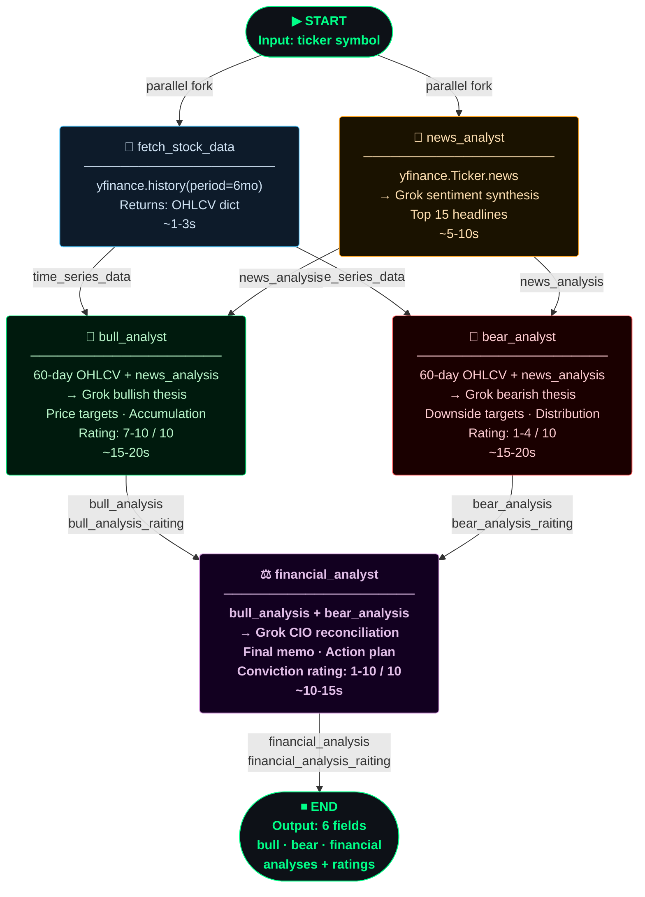
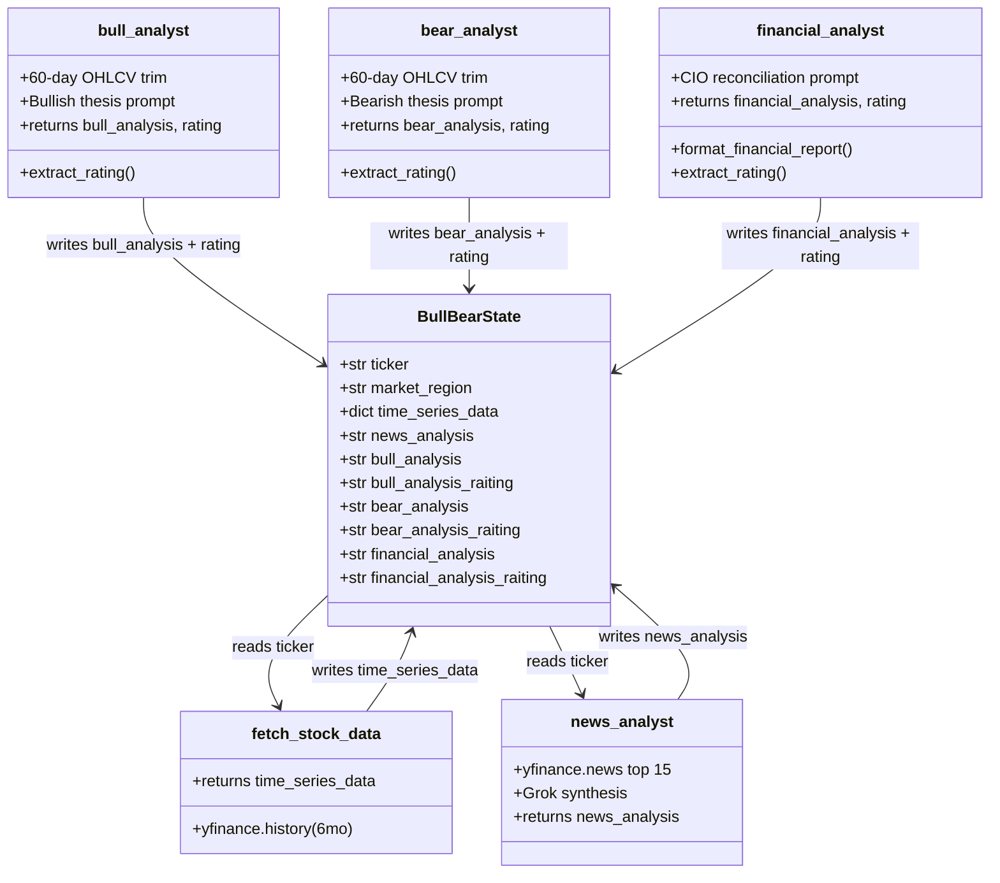

# BullBear — LangGraph State Diagram

## Agent Workflow



## State Schema



## Parallelisation Map

```
Wall-clock timeline (approximate):

t=0s   ──────────────────────────────────────────────────────────────
        │ fetch_stock_data     ├───────┤  (~3s)
        │ news_analyst         ├──────────────────┤  (~10s)
                                                   │
t=10s  ──────────────────────────────────────────────────────────────
                                        │ bull_analyst  ├──────────────────┤
                                        │ bear_analyst  ├──────────────────┤
                                                                           │
t=30s  ──────────────────────────────────────────────────────────────
                                                         │ financial_analyst ├────────┤
                                                                                       │
t=45s  ──────────────────────────────────────────────────────────────  ✅ DONE
```

> **Critical path**: `news_analyst` (slowest parallel branch) → `bull/bear_analyst` (parallel) → `financial_analyst`
>
> **Speedup from parallelisation**: ~50% faster vs. sequential execution
